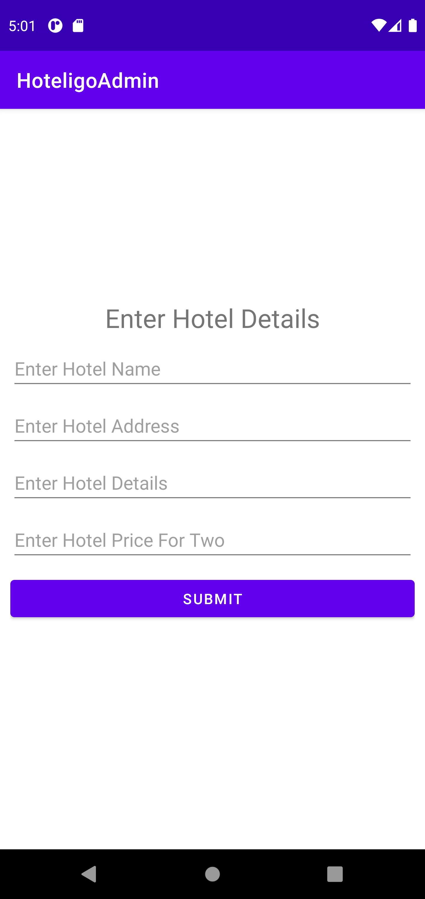

# Hoteligo-Admin-Application

 

This application is used to add or update the information of the hotels in the [Hoteligo Android Application](https://github.com/vishwaksena-vishnu/Hoteligo-Android-Application)

Below is the image of the application:

